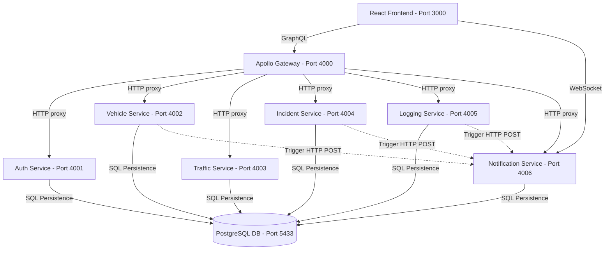

# Urban Traffic Intelligence Platform

An intelligent, real-time, microservices-based urban traffic monitoring, incident logging, and central notification system. The platform consists of a React-based frontend client, a unified GraphQL API gateway, and six specialized microservices communicating over a shared PostgreSQL database and real-time WebSockets.

---

## Architecture Overview



---

## Services & Feature Set

### 1. Unified GraphQL Gateway (Port `4000`)
The single entry-point for all frontend client operations, proxying REST endpoints into a structured GraphQL API.
*   **Queries**: User dashboard metrics, vehicle listings, traffic zones, active incidents, centralized admin logs (with pagination and filters), and user-specific notification logs.
*   **Mutations**: User registration and login, vehicle registration, vehicle position reporting, traffic zone definition, incident registration, incident status transitions, notification read status toggles, and global announcement broadcasting.

### 2. Authentication Service (Port `4001`)
Manages user sessions, credentials, and role-based permissions.
*   **Features**:
    *   Secure user registration with bcrypt password hashing.
    *   JWT authentication issuance.
    *   Role configuration (`ADMIN` and `OPERATOR`).
    *   User listing query (administrative role required).

### 3. Vehicle Service (Port `4002`)
Tracks vehicles and captures live GPS telemetry.
*   **Features**:
    *   Vehicle registration and database record management.
    *   GPS position recording (`latitude`, `longitude`, `speed`).
    *   Downstream traffic density evaluation and trigger calls to the notification service when congestion occurs.
    *   Real-time vehicle position history tracking.

### 4. Traffic Service (Port `4003`)
Defines geographical zones of interest and classifies traffic flow.
*   **Features**:
    *   Traffic zone definitions (configured with coordinate boundaries `latitude_min`, `latitude_max`, `longitude_min`, `longitude_max`).
    *   Traffic density calculations based on active vehicles reporting locations within zone boundaries.
    *   Automatic flow classification: `Faible` (0-2 vehicles), `Moyen` (3-5 vehicles), and `Élevé` ($\ge 6$ vehicles).

### 5. Incident Service (Port `4004`)
Logs and tracks disruptions, road closures, and traffic incidents.
*   **Features**:
    *   Incident creation with fields for `title`, `description`, `type` (`Accident`, `Travaux`, `Route fermée`, `Embouteillage`), and coordinates.
    *   Incident status updates (`Signalé` $\rightarrow$ `En cours` $\rightarrow$ `Résolu`).
    *   Triggers incident status alerts to the central notification system.

### 6. Central Logging Service (Port `4005`)
Centralized audit logs and application traces console. Accessible to `ADMIN` roles only.
*   **Features**:
    *   Audit Logging: Records creation/modification actions, actors, and resource context.
    *   Application Logging: Records runtime errors, database warning traces, and service failures.
    *   Advanced queries with filtering (type, severity level, module, username) and full-text search.

### 7. Notification Service (Port `4006`)
Real-time central event broadcaster.
*   **Features**:
    *   Dual-protocol capability: REST API (`POST /notifications` for internal service calls) and WebSocket (`ws://` server for clients).
    *   WebSocket connections secured using JWT parameters on connection upgrades.
    *   Congestion alert deduplication (5-minute window per zone to avoid alert spam).
    *   Global admin announcement broadcasts.

---

## Technical Stack & Folder Structure

*   **Frontend**: React (Vite), Apollo Client, Material UI, React Router.
*   **Backend**: Node.js, Express, Apollo Server (GraphQL), PG (Postgres client), WS (WebSocket server).
*   **Orchestration**: Docker Compose, Dockerfiles per service.

```text
├── backend
│   ├── auth-service         # Auth Express microservice
│   ├── gateway              # Apollo GraphQL Gateway
│   ├── incident-service     # Incident Express microservice
│   ├── logging-service      # Log Central Express microservice
│   ├── notification-service # WebSocket / REST Notification microservice
│   ├── traffic-service      # Traffic Zone Express microservice
│   └── vehicle-service      # Vehicle & GPS tracking microservice
├── db
│   └── init.sql             # SQL Database schemas & mock data
├── frontend
│   ├── src
│   │   ├── App.jsx          # Main client interface & WS connection
│   │   └── styles.css       # Layout styles & animations
│   └── Dockerfile
├── docker-compose.yml       # Orchestration file
└── README.md                # Project documentation
```

---

## Prerequisites & Installation

To run this application, ensure you have the following installed on your machine:
*   [Docker Desktop](https://www.docker.com/products/docker-desktop/) (Docker Engine $\ge$ 20.10)
*   [Node.js](https://nodejs.org/) (Version $\ge$ 18.0) - *Only required for local development outside containers.*

---

## Démarrage (Running the Application)

### 1. Run using Docker (Recommended)
You can start all services, frontend, and database instantly using Docker Compose:

```bash
# Build images and start the stack in the background
docker compose up -d --build
```

To view logs for all services:
```bash
docker compose logs -f
```

To stop the containers:
```bash
docker compose down -v
```

### 2. Running Locally (Alternative Development Setup)
If running services locally outside of Docker, configure your environment by copying `.env.example` in each service directory to `.env`, install the dependencies, and start:

```bash
# Install dependencies from the root monorepo
npm install

# Start individual microservice (example: auth-service)
cd backend/auth-service
npm run dev
```

---

## Access Information

| Application / Service | External URL / Endpoint | Protocol / Format |
| :--- | :--- | :--- |
| **Frontend Client** | `http://localhost:3000` | HTTP / Web Page |
| **GraphQL Gateway** | `http://localhost:4000/graphql` | HTTP POST / GraphQL Schema |
| **Auth Service** | `http://localhost:4001/health` | HTTP GET / JSON |
| **Vehicle Service** | `http://localhost:4002/health` | HTTP GET / JSON |
| **Traffic Service** | `http://localhost:4003/health` | HTTP GET / JSON |
| **Incident Service** | `http://localhost:4004/health` | HTTP GET / JSON |
| **Logging Service** | `http://localhost:4005/health` | HTTP GET / JSON |
| **Notification Service (REST)** | `http://localhost:4006/health` | HTTP GET / JSON |
| **Notification Service (WS)** | `ws://localhost:4006/?token=<JWT>` | WebSocket Protocol |
| **Shared Database** | `localhost:5433` (container 5432) | PostgreSQL Connection |

---

## Database Schema & Inspection Queries

### 1. Database Configuration
*   **Database Host**: `localhost` (Host machine) / `db` (Within Docker network)
*   **Database Port**: `5433` (Host mapping) / `5432` (Container port)
*   **Database Name**: `webservice`
*   **Username**: `postgres`
*   **Password**: `12345678`

### 2. Useful SQL Inspection Queries

Connect using your preferred GUI (DBeaver, pgAdmin) or via the terminal:
```bash
docker exec -it webservices-db psql -U postgres -d webservice
```

#### Query 1: View System Application Errors & Centralized Log Audit Trail
```sql
-- Retrieve the latest 50 application error traces and admin audits
SELECT id, log_type, level, module, message, username, action, created_at 
FROM logs 
ORDER BY created_at DESC 
LIMIT 50;
```

#### Query 2: Inspect Active Incidents (Excludes Resolved)
```sql
SELECT id, title, type, status, latitude, longitude, created_at 
FROM incidents 
WHERE status != 'Résolu' 
ORDER BY created_at DESC;
---

## WebSocket & Real-Time Event Guide

To connect directly to the real-time event pipeline, open a WebSocket connection.

### Connection Handshake
Clients must provide a valid JWT token in the query parameters during the upgrade phase:
```text
ws://localhost:4006/?token=<JWT_TOKEN>
```
*Note: Invalid or missing tokens will result in immediate handshake rejection (HTTP 401).*

### Message Payload Format
When an event occurs, the server sends a JSON payload:
```json
{
  "event": "notification",
  "data": {
    "id": 14,
    "user_id": 3,
    "title": "Nouvel incident signalé : Accident",
    "message": "Embouteillage majeur - Collision au carrefour Nord",
    "type": "INCIDENT",
    "is_read": false,
    "created_at": "2026-06-04T13:12:58.366Z"
  }
}
```

